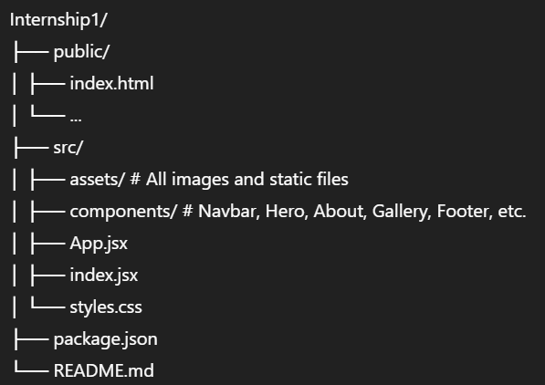

# Internship1 – Kingsukh Guest House Website

A modern, fully responsive website project built using React, Tailwind CSS, and supporting libraries.  
Designed as part of an internship, this project demonstrates smooth scrolling navigation, animated sections, carousels, and integration with external APIs (e.g., Google Maps).

---

## 🚀 Features

- Responsive **Navbar** with hamburger menu (mobile)
- **Smooth Scroll** navigation
- **Hero, About, Rooms, Services, Stats, Gallery, Contact** sections
- **React Slick** carousel for image gallery
- **Google Maps Embed**
- **Sticky Footer**
- **AOS animations** for scroll effects
- Built with **React + Tailwind CSS**
- Backend-ready structure (optional Socket.IO support)

---

## 📂 Folder Structure

